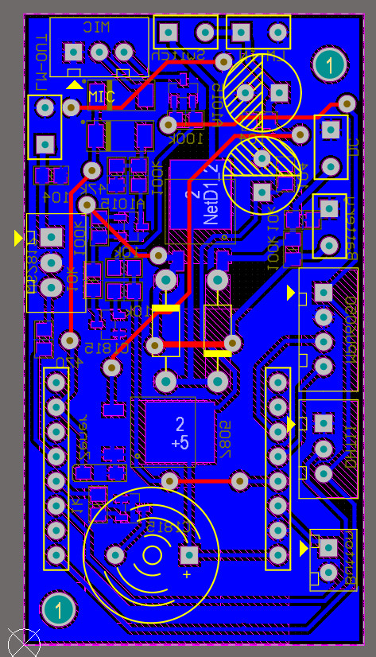
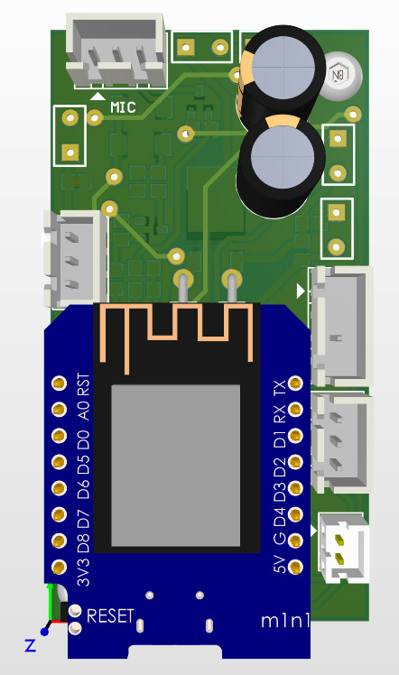
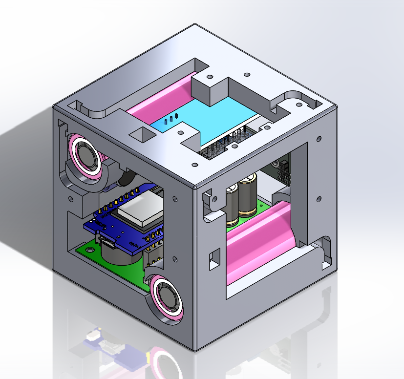
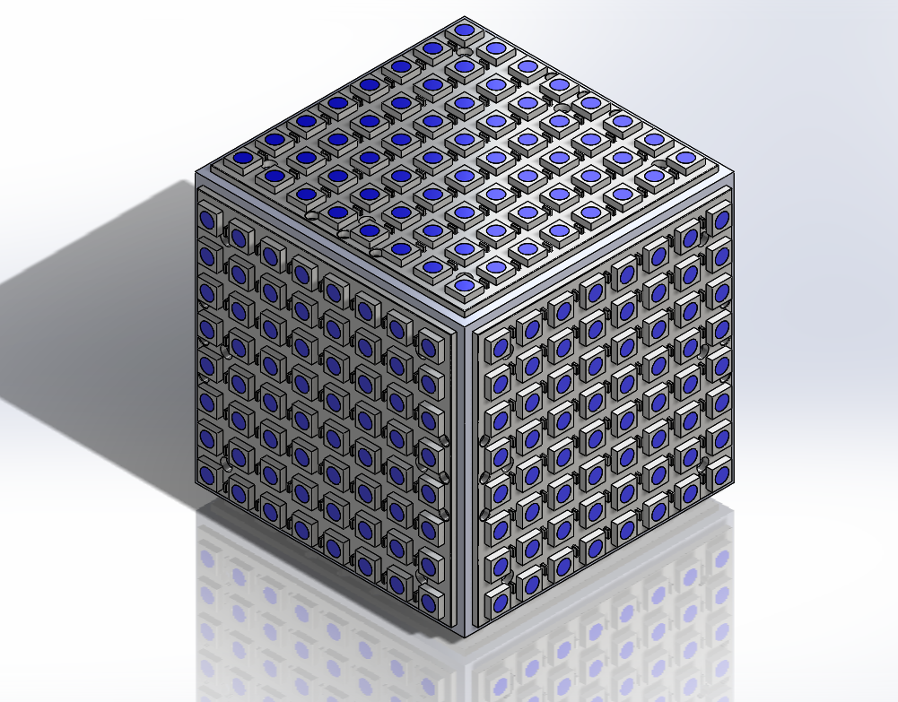

# Led-Cube
Led Cube has 6 sides and is led matrix ws2812 8x8. It uses Wemos D1 Mini (ESP8266) and sensors such as temperature, humidity, mic, and accelerometer. It can connect to WiFi and is controlled via an app on an Android phone.

## PCB designed on Altium
<table>
  <tr>
    <td></td>
    <td></td>
  </tr>
</table>

## 3D models designed in SolidWorks
<table>
  <tr>
    <td></td>
    <td></td>
  </tr>
</table>

## Android application
<table>
  <tr>
    <td></td>
    <td></td>
    <td></td>
  </tr>
</table>